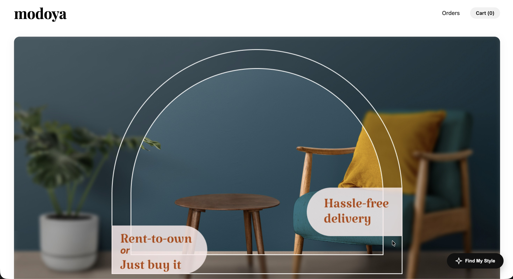
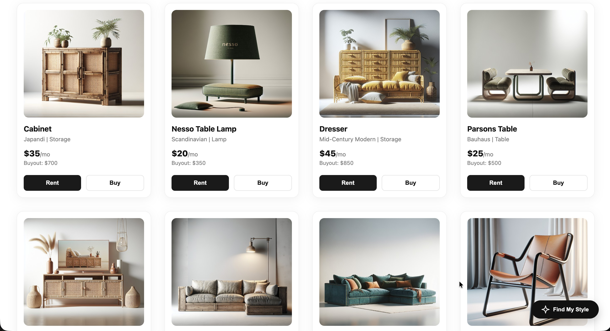
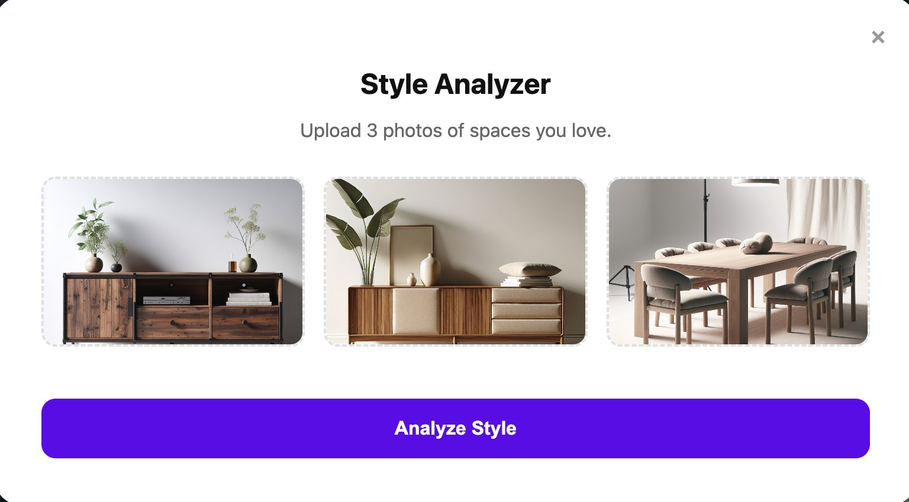
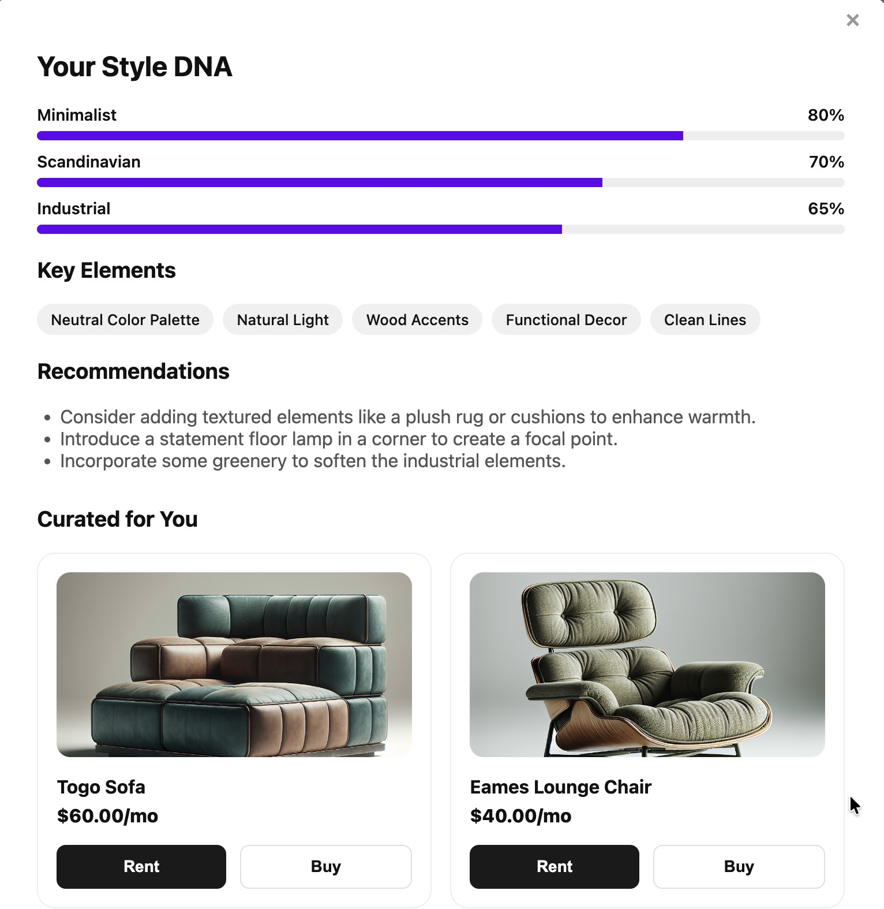
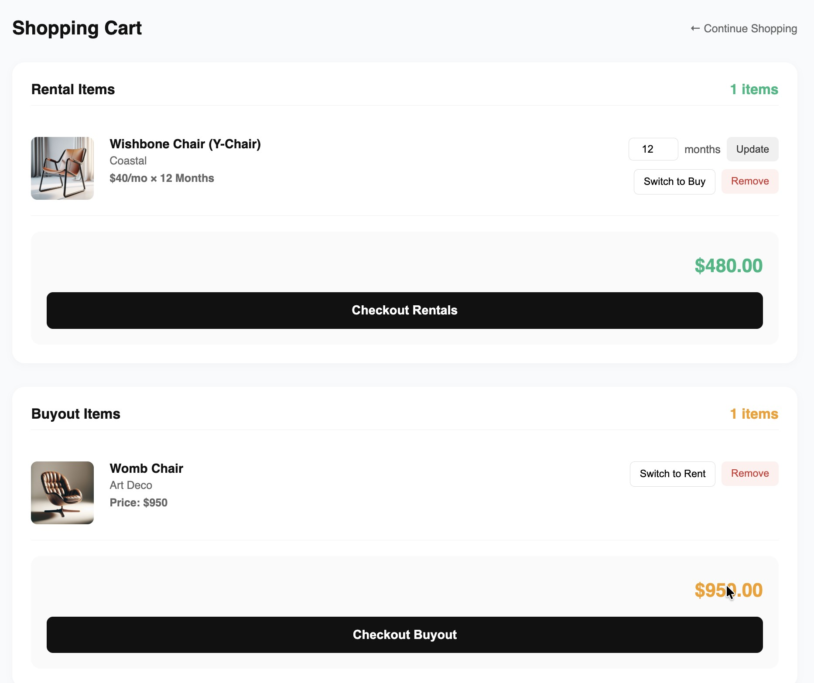
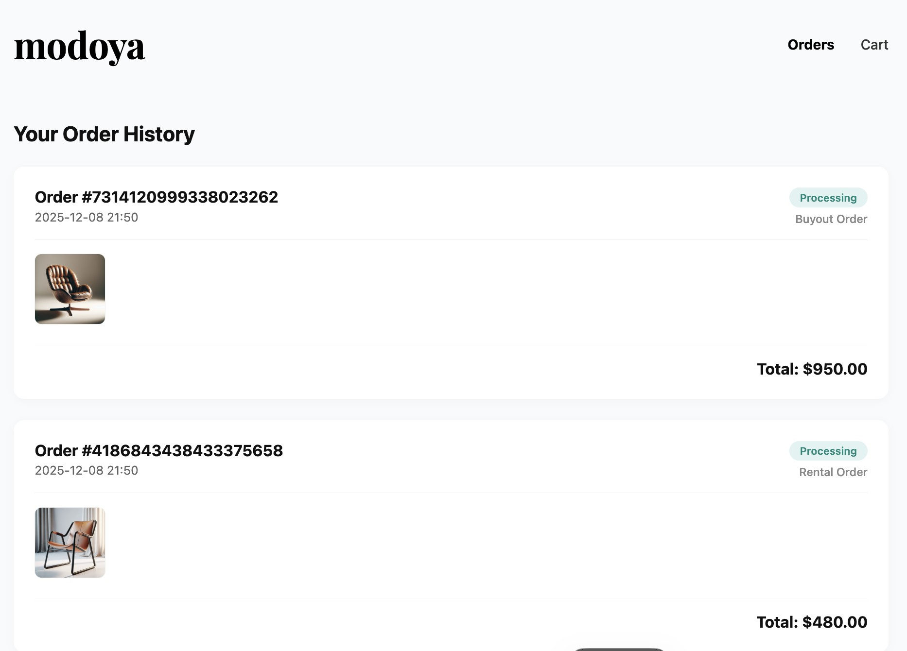

# Modoya - Furniture Rental & Buyout Platform

**HCI 584 Final Project - Fall 2025**

Modoya is a web-based furniture platform that offers flexible ownership options. Users can choose to rent high-quality furniture for a monthly fee or purchase items outright ("buyout"). The platform features an AI-powered **Style Analyzer**, which uses the OpenAI API to analyze user-uploaded room photos and recommend furniture that matches their personal interior design style.




## Key Features

* **Flexible Ownership:** Seamlessly toggle between "Rent" (monthly payments) and "Buy" (one-time purchase) options for every item.
* **AI Style Analyzer:** Upload 3 photos of your space, and our AI (powered by GPT-4o) will analyze your "Style DNA" and recommend matching furniture.
* **Dynamic Cart:** Real-time updates for rental duration and order types.
* **Order Tracking:** View rental and purchase history with generated order IDs.

### AI Style Analyzer
Upload three reference photos of interior spaces you love, and our AI will analyze your aesthetic preferences.


### Analysis & Recommendations
View your personalized "Style DNA" breakdown along with curated furniture recommendations that match your taste.


### Dynamic Cart Management
The cart separates rental and buyout items to prevent confusion. You can easily toggle between "Rent" and "Buy" modes for any item and customize your rental duration.


### Order Confirmation
Upon successful checkout, you will receive an order confirmation with a unique transaction ID.


## Prerequisites

* Python 3.8+
* OpenAI API Key (Required for Style Analyzer)

## Installation & Setup

1.  **Clone the repository**
    ```bash
    git clone https://github.com/vvn-hsu/modoya.git
    cd modoya
    ```

2.  **Install Dependencies**
    ```bash
    pip install -r requirements.txt
    ```

3.  **Configure API Key**
    For security reasons, the API key is not included in the repository. You must create a configuration file locally:
    * Create a file named `keys.py` in the root directory.
    * Add your OpenAI API key:
        ```python
        # keys.py
        OpenAI_key = "sk-your-actual-api-key-here"
        ```

## How to Run

1.  Start the Flask server:
    ```bash
    python main.py
    ```

2.  Open your browser and navigate to:
    `http://127.0.0.1:5000/`

## Project Structure

* `main.py`: Main application entry point and Flask routes.
* `module.py`: Core logic for data handling, filtering, and price calculations.
* `templates/`: HTML frontend files.
* `Pictures/`: Furniture image assets.
* `requirements.txt`: Python dependencies.

## License

Created by Vivian Hsu for HCI 584 at Iowa State University.